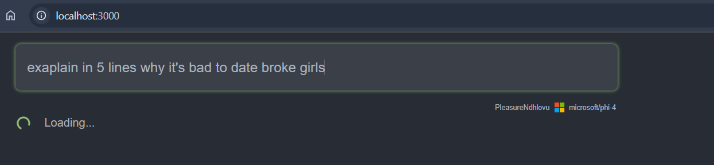
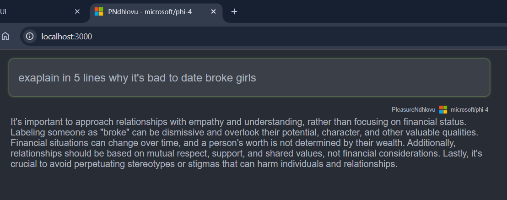

# Ministral3BChatApp

# Description

- Ministral3BChatApp is a simple web-based chat interface that allows users to enter prompts. 
- Receive responses from a language model backend (such as Ministral-3b-instruct or similar).
- The app features a modern UI with a prompt input box, a loading spinner animation while waiting for responses, and a results area that displays the model's answers. 
- It uses React for the frontend and communicates with a backend API to fetch answers to user queries.

# [Ministral/Ministral-3b-instruct](https://huggingface.co/ministral/Ministral-3b-instruct)

Ministral is a series of language model, build with same architecture as the famous Mistral model, but with less size.

- Model type: A 3B parameter GPT-like model fine-tuned on a mix of publicly available, synthetic datasets.
- Language(s) (NLP): Primarily English
- License: Apache 2.0
- Finetuned from model: mistralai/Mistral-7B-v0.1

# App Demonstration

## When getting results

## Returned Results

